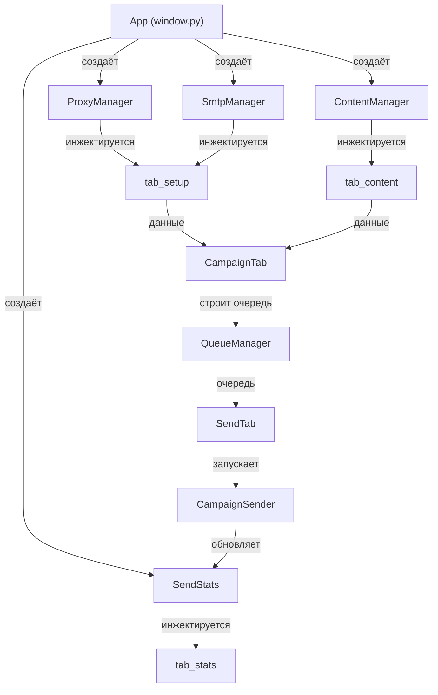

# 🏗️ Архитектура CHARLY MAILER

> Полное описание архитектуры проекта: модули, потоки данных, многопоточность, пресеты и логирование.

---

## Карта модулей

### `core/` — ядро приложения

| Модуль | Назначение |
|---|---|
| `storage.py` | Загрузка и хранение списков (emails, proxies, SMTP-аккаунты) |
| `proxy_manager.py` | Управление прокси: ротация, проверка, статистика |
| `smtp_manager.py` | Управление SMTP-аккаунтами: подключение, проверка, ротация |
| `content.py` | Контент-менеджер: шаблоны, спинтакс, макросы `[[LINK]]` / `[[UNSUB]]` |
| `queue_manager.py` | Построение очереди рассылки (email × SMTP-аккаунт) |
| `stats.py` | Сбор статистики отправки: успехи, ошибки, bounce, CSV-экспорт |
| `logger.py` | `JsonLogger` — потокобезопасное логирование в JSON-lines |
| `sender.py` | `CampaignSender` — главный движок рассылки в фоновом потоке |
| `presets.py` | Сериализация/десериализация пресетов кампании (JSON) |

### `gui/` — графический интерфейс (CustomTkinter)

| Модуль | Назначение |
|---|---|
| `theme.py` | Тема оформления: цвета, шрифты, стили виджетов |
| `window.py` | Главное окно `App`: создание менеджеров, вкладок, пресет-меню |
| `tab_setup.py` | Вкладка «Настройка»: загрузка файлов, прокси, SMTP |
| `tab_content.py` | Вкладка «Контент»: тема, тело письма, вложения, макросы |
| `tab_campaign.py` | Вкладка «Кампания»: параметры рассылки, задержки, лимиты |
| `tab_send.py` | Вкладка «Отправка»: запуск/пауза/стоп, прогресс-бар, лог |
| `tab_stats.py` | Вкладка «Статистика»: таблицы, графики, CSV-экспорт |

---

## Поток данных



### Последовательность:

1. **`App`** создаёт разделяемые менеджеры: `ProxyManager`, `SmtpManager`, `ContentManager`, `SendStats`
2. Менеджеры **инжектируются** в соответствующие вкладки через конструкторы
3. **`CampaignTab`** собирает параметры и строит очередь через `QueueManager`
4. **`SendTab`** запускает `CampaignSender` в рабочем потоке
5. `CampaignSender` отправляет письма, обновляет `SendStats`
6. GUI получает обновления через `parent.after()` callback'и

---

## Модель многопоточности

### Основной принцип

> [!IMPORTANT]
> GUI работает в главном потоке (Tk mainloop). Вся тяжёлая работа — в daemon-потоках.

### CampaignSender (daemon thread)

- Запускается как `threading.Thread(daemon=True)`
- Управляется через два события:
  - **`stop_event`** — полная остановка
  - **`pause_event`** — приостановка (set = пауза)
- Задержка между письмами реализована через `stop_event.wait(delay)` — отменяемый sleep
- Обновление GUI: `parent.after(0, callback)` из рабочего потока

### ProxyManager / SmtpManager — массовая проверка

- `check_all()` использует `concurrent.futures.ThreadPoolExecutor`
- Параллельная проверка всех прокси/SMTP с лимитом потоков

### Защита состояния

- Все разделяемые структуры данных защищены `threading.Lock`
- `SendStats` — атомарные счётчики под блокировкой
- `JsonLogger` — единый `write_lock` для записи в файл

```
┌─────────────────────────────────────────────┐
│              Main Thread (Tk)               │
│  ┌─────────┐ ┌─────────┐ ┌──────────────┐  │
│  │ tab_send│ │tab_stats│ │  tab_setup   │  │
│  └────┬────┘ └────┬────┘ └──────┬───────┘  │
│       │           │             │           │
│  parent.after()   │      ThreadPoolExecutor │
│       │           │             │           │
├───────┼───────────┼─────────────┼───────────┤
│       ▼           │             ▼           │
│  ┌─────────┐      │     ┌─────────────┐    │
│  │Campaign │      │     │ check_all() │    │
│  │ Sender  │──────┘     │  (proxies/  │    │
│  │ (daemon)│             │   smtp)    │    │
│  └─────────┘             └─────────────┘    │
│         Worker Threads                      │
└─────────────────────────────────────────────┘
```

---

## Система пресетов

### Сохранение
`App.gather_full_preset()` обходит все вкладки и собирает:
- Пути к файлам (emails, proxies, SMTP)
- Параметры контента (тема, тело, вложения)
- Настройки кампании (задержки, лимиты, режимы)

Результат сериализуется в **JSON** и сохраняется на диск.

### Загрузка
`App.apply_full_preset()`:
1. Читает JSON-файл пресета
2. Загружает указанные файлы данных
3. Устанавливает значения UI-виджетов
4. Обновляет состояние менеджеров

> [!TIP]
> Пресеты позволяют быстро переключаться между кампаниями без повторной настройки.

---

## Логирование

### JsonLogger (singleton)

- **Единственный экземпляр** на всё приложение (см. [[30-decisions]] — почему singleton)
- **Потокобезопасный**: единый `write_lock` для всех потоков
- **Формат**: JSON-lines (одна JSON-строка = одно событие)
- **Ротация**: ежедневные файлы в `logs/` директории
- **Структура записи**:

```json
{
  "timestamp": "2026-07-02T04:30:00",
  "level": "INFO",
  "thread": "CampaignSender",
  "event": "email_sent",
  "data": {"to": "user@example.com", "smtp": "sender@mail.com"}
}
```

---

## Связанные документы

- [[00-overview]] — обзор проекта
- [[30-decisions]] — ключевые архитектурные решения
- [[20-tasks/12-audit]] — аудит кода
- [[40-errors]] — журнал ошибок
