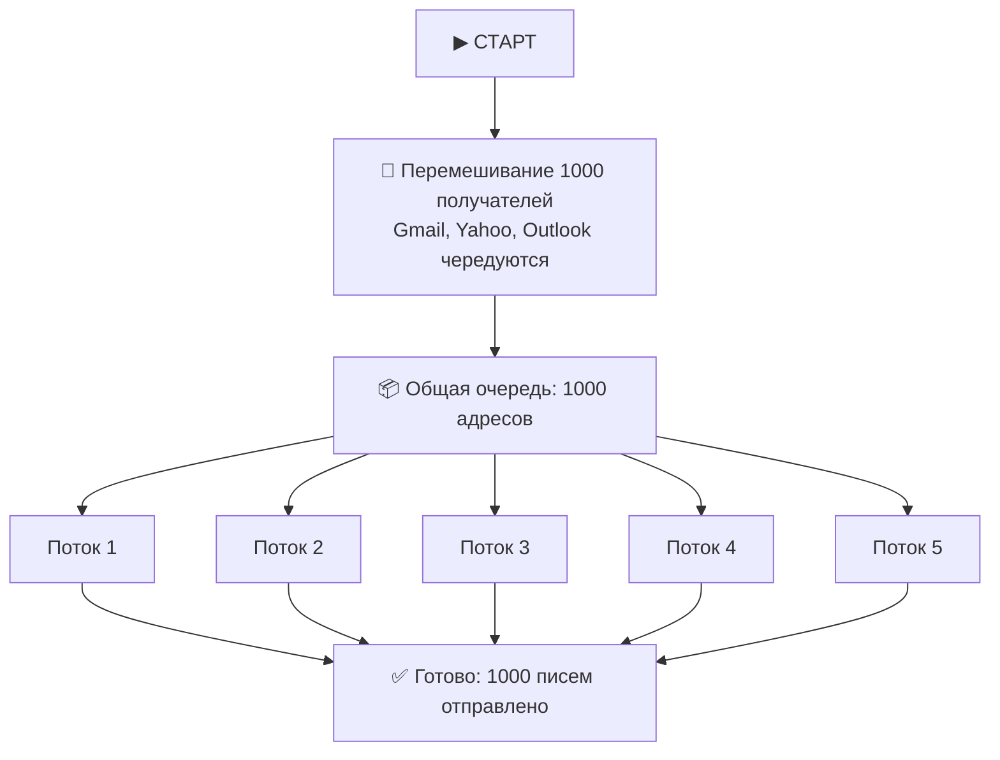
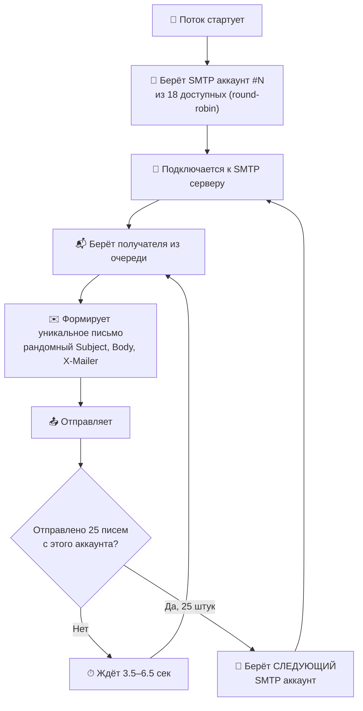

# 📊 Как работает рассылка с твоими настройками

## Твои настройки (со скриншота)

| Параметр | Значение | Что это |
|----------|----------|---------|
| Задержка | **5** сек | Пауза между письмами (твоё значение, НЕ авто) |
| ±Разброс | **1.5** сек | Каждая пауза = 5 ± 1.5 = **от 3.5 до 6.5 сек** |
| Макс. потоков | **5** | Сколько писем шлётся **одновременно** |
| Писем/коннект | **25** | После 25 писем → смена аккаунта + реконнект |
| SMTP аккаунтов | **18** | Загружено 18 отправителей |
| Получателей | **1000** | Загружено 1000 адресов |

---

## Общая схема



---

## Что делает КАЖДЫЙ из 5 потоков



---

## Распределение 1000 получателей по 18 аккаунтам

Поскольку **5 потоков** берут получателей из **общей очереди**, а каждый аккаунт отправляет **25 писем** за одно подключение:

```
Общая очередь: [1000 получателей перемешаны по доменам]
                    ↓ ↓ ↓ ↓ ↓  (5 потоков берут по одному)

Поток 1: smtp_01 → 25 писем → smtp_06 → 25 писем → smtp_11 → 25 писем → smtp_16 → 25 писем → ...
Поток 2: smtp_02 → 25 писем → smtp_07 → 25 писем → smtp_12 → 25 писем → smtp_17 → 25 писем → ...
Поток 3: smtp_03 → 25 писем → smtp_08 → 25 писем → smtp_13 → 25 писем → smtp_18 → 25 писем → ...
Поток 4: smtp_04 → 25 писем → smtp_09 → 25 писем → smtp_14 → 25 писем → ...
Поток 5: smtp_05 → 25 писем → smtp_10 → 25 писем → smtp_15 → 25 писем → ...
```

### Итого каждый аккаунт отправит:

```
1000 получателей ÷ 18 аккаунтов ≈ 55-56 писем на аккаунт

smtp_01: ~56 писем (2-3 подключения по 25)
smtp_02: ~56 писем
smtp_03: ~56 писем
...
smtp_18: ~55 писем
```

> [!IMPORTANT]
> Распределение **примерно равное**, потому что аккаунты берутся по кругу (round-robin).
> Каждый аккаунт отправит **~55-56 писем** за всю кампанию.

---

## Скорость и время

```
5 потоков × 1 письмо каждые ~5 сек = примерно 1 письмо в секунду

1000 писем ÷ 1 письмо/сек = ~1000 сек = ~17 минут
```

> [!NOTE]  
> Первые ~10 писем с каждого аккаунта идут медленнее (warmup ×3 = ~15 сек вместо 5).
> После 25+ писем с аккаунта — почти полная скорость (×1.3).
> После 100+ — полная скорость (×1.0).
> 
> Реальное время: **~20-25 минут** с учётом warmup.

---

## Что рандомизируется в КАЖДОМ из 1000 писем

| Элемент | Как |
|---------|-----|
| **Subject** | Из файла + спинтакс `{привет\|здравствуйте}` |
| **Body** | Из файла + спинтакс + `{{email}}` подстановка |
| **Sender Name** | Случайный из файла имён |
| **X-Mailer** | `Outlook 15.0.4832.7291` — уникальный каждый раз |
| **Message-ID** | Уникальный UUID |
| **Date** | ±30 сек от текущего времени |
| **EHLO** | `mail.domain.com` — на основе домена отправителя |
| **List-Unsubscribe** | Уникальный unsub ID |
| **MIME Boundary** | Рандомный формат |
| **Задержка** | 3.5–6.5 сек (рандом каждый раз) |

---

## Простая формула

```
             ТВОИ настройки (delay=5, conn=25)
                        ↓
    ┌─────────────────────────────────────────┐
    │  delay > 0?  → ДА → Используем ТВОИ 5с  │
    │  conn > 0?   → ДА → Используем ТВОИ 25  │
    │                                         │
    │  delay = 0?  → Авто (Gmail 2-5с,        │
    │                       Yahoo 3-8с,        │
    │                       Corp 0.8-2.5с)     │
    │  conn = 0?   → Авто (Gmail 30,          │
    │                       Yahoo 20,          │
    │                       Corp 60)           │
    └─────────────────────────────────────────┘
```

**Вывод:** С твоими настройками (5/1.5/5/25) — все значения ТВОИ, domain profiles НЕ используются. Если хочешь авто-подстройку под домены — ставь `0`.
